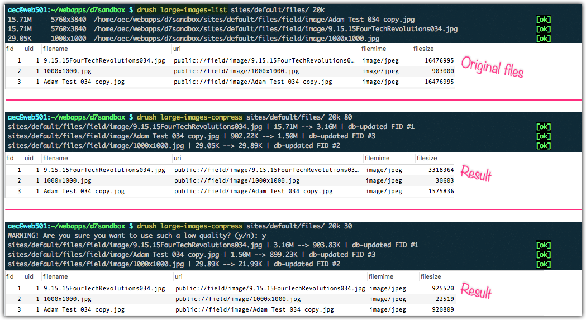
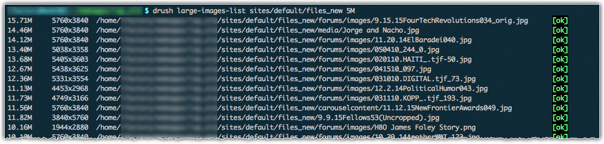

## Introduction
This provides two drush commands.

1. `large-images-list` will list the largest images (by file size) found in a directory (and its subdirectories by default)
1. `large-images-compress` will compress (shrink file size of) images and update the associated record in Drupal's file_managed table

* Both of these commands require you to specify the directory to search, and the minimum size you'd like to operate on.
* Both of these commands also allow you to specify a maxdepth.
* The compression command takes an additional (required) "quality" argument. This can be anything from 1 to 100 (lowest output quality to highest output quality). For general use the recommended value is somewhere around 80 or 90.
* Run either command with --help to see all options. For example: `drush large-images-list --help`

## WARNING

I suggest running `large-images-list` before running `large-images-compress`. This does not modify anything on your system.

These commands work fine in the environments where I've used them. This does not mean it'll work perfectly for you!

Because of the disruptive nature of the `large-images-compress` command, you should test this drush command in a test directory within your environment before trying to use it "for real."

Also, you may want to back up your Drupal database and whatever directory you're operating on before executing this command.

## Requirements

- Drupal 7 site
- drush
- `find` command
- `du` command
- `sort` command
- `cut` command

## Examples

