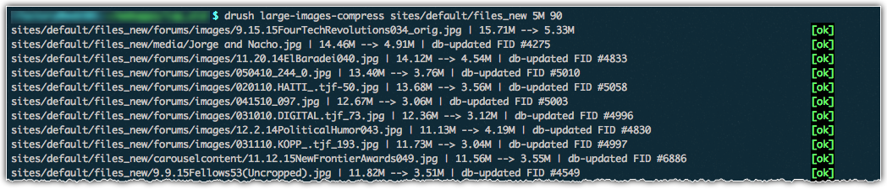

## WARNING:

I suggest running `large-images-list` before running large-images-compress. This does not modify anything on your system.

These commands work fine in the environments where I've used them. This does not mean it'll work perfectly for you!

Because of the disruptive nature of the `large-images-compress` command, you should test this drush command in a test directory within your environment before trying to use it "for real."

Also, you may want to back up your Drupal database and whatever directory you're operating on before executing this command.

## Requirements:

- drush
- Drupal 7
- *find* (\*nix)
- *du* (\*nix)
- *sort* \*nix)
- *cut* (\*nix)

## Examples

